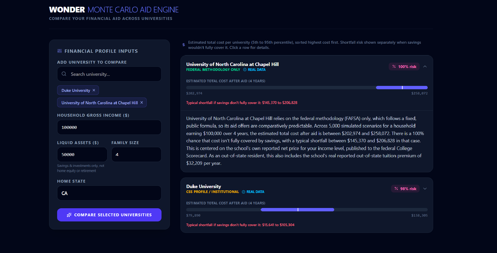

# Wonder

**Live demo:** [Frontend](https://wonder-financial-aid.vercel.app) | [Backend API](https://wonder-alpha-three.vercel.app/api/colleges)

Wonder estimates what a family will actually pay for college, and how much that estimate could vary, for over 1,700 US schools.



## The problem

Every college publishes its own net price calculator, and every one of them asks for the same financial information. Applying to ten schools means filling out ten forms with the same numbers, and each school comes back with a different answer because they use different methods to calculate aid. The CSS Profile and the FAFSA don't agree with each other, and neither one tells you what a specific school will actually offer.

I ran into this directly during my college applications. I wanted one place to enter my family's finances once and see a realistic range of what each school would cost, instead of a single number that might not hold up once a real aid office looks at the file.

## What it does

You enter household income, assets, family size, and home state once. You add any schools you're considering, up to six at a time, and Wonder runs a simulation for each one and shows you the likely range of what you'd pay, not just a single average.

- Compares multiple schools side by side from one set of inputs
- Shows a probability of facing a funding shortfall, not just an average cost
- Widens or narrows that range depending on how predictable a school's aid process actually is
- Adjusts public school estimates based on whether you live in that state
- Pulls real cost and aid data from the federal government for every school it can, and says so when it does

## How it works

Instead of computing one fixed number for what a school will cost, Wonder runs thousands of simulated scenarios per school and looks at the spread of outcomes. Two things drive that spread.

The first is the school's aid methodology. Schools that use the CSS Profile weigh things like home equity and a parent's business assets that the federal formula doesn't touch, and their aid offices have more discretion in general. That makes their aid harder to predict, so those schools get a wider range in the simulation. Schools that only use the federal methodology follow a fixed public formula, so their range is narrower.

The second is location. Public schools charge in-state and out-of-state students very different amounts, sometimes two to three times as much. Wonder pulls each school's real in-state and out-of-state tuition and adds that difference for anyone applying from outside the school's home state.

Wherever possible, the numbers driving all of this come from the College Scorecard, a public dataset the Department of Education maintains on what students at each school actually pay by income bracket. When a school doesn't publish enough of that data, Wonder says so instead of quietly guessing.

## Product decisions worth knowing about

A few choices were made on purpose and are worth explaining rather than hiding:

- Whether a school requires the CSS Profile isn't published anywhere as structured data, so this is inferred from whether a school is public or private. It's a reasonable proxy, not a verified fact for every school.
- The width of the simulated range (how much uncertainty to apply) is a reasoned estimate, not something calibrated against real award letter data, since that data isn't public. The center of each estimate is real; the spread around it is a modeling choice.
- Schools without enough published net price data are left out of the list entirely rather than filled in with a guess. A shorter, honest list was chosen over a longer one with invented numbers.
- Liquid assets (savings, checking, taxable investments, not a home or retirement accounts) raise the estimate using the same assessment rate the federal aid formula publishes, capped at the school's actual full price so nobody is modeled as paying more than sticker price. Excluding home equity and retirement matches what the federal formula itself excludes, though it also means the broader set of assets CSS Profile schools sometimes weigh, like home equity, isn't captured.
- Family size is collected but currently has no effect on the estimate. The real reason it should matter, a federal allowance that protects more income for larger families, doesn't have a clean equivalent in this model, since net price comes from real published data keyed only by income, not from a formula this project computes itself. Rather than invent a number for it, it's left unused and disclosed here.

## Tech stack

- **Backend:** Python, FastAPI, NumPy, pandas
- **Frontend:** React, Vite
- **Data:** College Scorecard API (US Department of Education)
- **Testing:** pytest
- **CI:** GitHub Actions, running the test suite and frontend build on every push
- **Hosting:** Vercel

## Running it locally

**Backend**

```
python -m venv venv
venv\Scripts\activate        # Windows
source venv/bin/activate     # macOS/Linux

pip install -r requirements.txt
uvicorn src.main:app --reload
```

**Frontend**

```
cd frontend
npm install
npm run dev
```

Copy `.env.example` to `.env` in both the project root and `frontend/` and fill in the values described in each file.

## Rebuilding the dataset

`colleges.csv` is generated from the College Scorecard API, not hand maintained. To refresh it with the latest published data:

```
python -m src.build_college_dataset
```

This requires a free API key from api.data.gov, set as `COLLEGE_SCORECARD_API_KEY` in `.env`.

## Testing

```
pytest src/
```

## What's next

The uncertainty ranges are currently a reasoned estimate rather than something calibrated against real award data, since that data isn't publicly available. If a source for it ever surfaces, that's the next thing worth improving.
